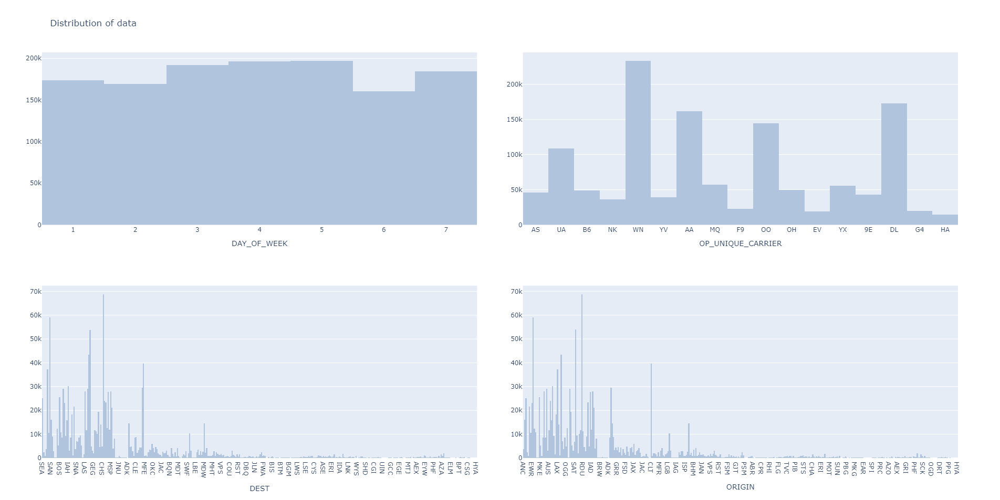
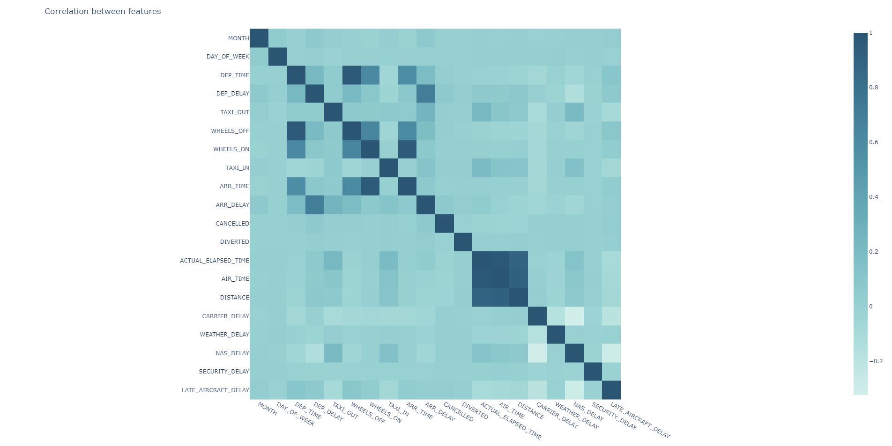

# Explorative data analysis (EDA)
In this section we're going to dive deep into the previously processed data. The data we're going to visualise today is a real world data gathered by the Bureau Of Transportation Statistics. It comes from US and consists of 100k+ records from May and June (2019). In this data analysis I'm going to go trough provided information and hopefully find some interesting insights.

## Introduction

According to airlines.org in 2019  **the average cost of an airport block for U.S. passenger airlines was $74.24 per minute. ** And crew costs, the second largest line item, rose 5 percent to $24.55 per minute. Delayed aircraft are estimated to have cost the airlines several billion dollars in additional expense and airlines fight against these situations in every way they can. In this data analysis I'm going to dive deep into US airlines and their reported delay from that year to deliver some insight into the problems each of them faces and how the numbers look on a larger scale.

## Exploring the features

First thing that I want to see is the distribution of the selected features. We already saw the skewness and some important information about them, but there's a few that might contribute some information if visualised. I'm going to create two groups of histograms, one for numerical and second for categorical features.

In the plots above we can see a few things. There's more small late aircraft delays rather than big ones. Weather causes either really big or really small delays. I assume that might be because when there's a small weather change it's better to wait a few minutes more on the airport, big delays happen when something serious is around and medium.. rarely, I imagine that when something could result in a medium kind of delay, it's not safe enough to assume that everything will be fine and it becomes a bigger delay. Another interesting thing is the distance, we can see it's quite nicely distributed, medium distance flights are the most common and probably the most often taken by people, actual elapsed time shows a clear relation to that.

Days of the week are quite similar when it comes to the distribution with a little bit less flights happening at the start of the week, and the least happening on Thursday. Airline distribution makes a lot of sense, Delta, Southwest and American Airlines are taking the top spots being the most popular carriers in the US.

## Bivariate correlations between features

Now it's time to start visualising the correlation between different features, I selected a few pairs that might provide the most informative result. We're going to start with displaying the arrival delay against distance.

In this plot we can clearly see how the distance affects potential delays, I will now make some assumptions about why we are seeing certain patterns in this data. First of all, the flights with highest distance suddenly become less prone to very high and very small delays. I imagine it could be caused by a few factors:

- Airlines cancel long flights could have a possibly big delay
- Long flights are prepared more carefully and it results with less small issues therefor fewer issues
- Short flights are more prone to surprise changes in department

Next up we have arrival delay by airline and from this plot we can clearly see which of them have the best scores. WN, F9 and AS have barely any high delays. HA has a few surprise big delays and DL is very consistent in every kind of delay. EV, UA and AA score the highest when it comes to arrival delay and the frequency of them.

When it comes to delays by the day of the week, people often make the wrong assumption that there's going to be the most big delays on Fridays, and nothing less correct. From the data gathered we know that the biggest delays happen on Mondays and Thursdays. 

To finish this section I'm going to look into the amount of flights in % by airlines. Looking at this we're met with a little bit different view on the previous data. We should take the size of an airline as well as the amount of its flight into consideration, smaller airports might have less issues because of their size. Big airlines like American Airlines taking up 12.6% of all flights will have more variance in the delays because of the sole variety they provide.

## Comparison of cancelled and diverted flights

In this comparison I will take a quick look at how different airlines approach the delays. First I'm going to start by plotting all cancelled and diverted flights   based on the airline.

It seems like most airlines have the same % of diverted flights aside of DL. Not only they have the least cancelled and diverted flight in general compared to other big airlines like AA or WN but they also interestingly more often divert flights than cancel them. One other considerably big airline, UA, also have a significantly less flights having issues but in their case there's more cancelled than diverted flights.

Now from this plot we can extract following information:

- If a delay happens, there's a higher probability of it being small no matter what airline
- AS, YX and HA have a small probability of big delays happening
- DL and OO have very good amount of medium and big delays compared to other big airlines

Here we have mean delays by airline, a little bit different way of showcasing the same data from the previous plot. From this we can tell that DL, HA and AS have the smallest mean delay happening from which DL is considerably big airline. EV on the other hand has the biggest mean delay of all while being what we'd consider in this data set a medium size airline.

_Small note: Some of the plots were created based on not normalized data to maintain the original time amount_

## Creating a feature heatmap

Before going forward I also want to take a quick look at the correlation of the features. The heatmap displays the relationships between them using a gradient colour scale. The purpose of showcasing it is the search for features that might be useful in the prediction as well as identifying features that are correlated to the point of containing similar data. As we can see on the graph below there's a few interesting relations.

- Departments, delays and arrivals are highly correlated, which makes sense since they depend on each other
- Air time, distance and actual elapsed time are probably holding information about the same data under different names

Knowing all of that, let's head to the next section where I'm [building the prediction model.](predictions.md)