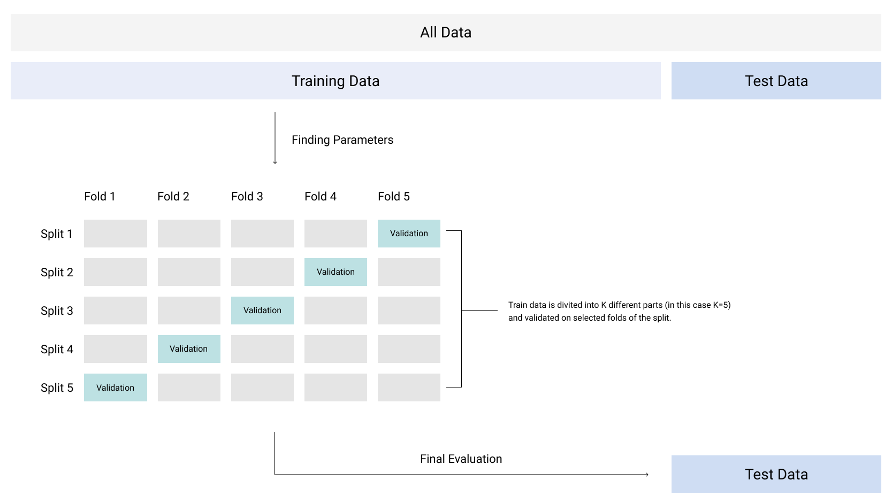

# Making predictions

Making predictions in this case shouldn't be too difficult. I decided to use a Light Gradient Boost since it's fast and can work efficiently with the amount of data we need to process. Light Gradient Boost, to which I will refer as LGB from now on, is nothing else than a basic gradient boosting but applied in a different way. The reason why LGB is so much faster lies in the way it expands its trees, Gradient Boost has a level wise tree growth where LGB has a leaf wise tree growth.


## Transforming the data

Before feeding my model with the data we still need to process it in a correct way. First I make sure that my delay levels, a column that I added manually and will act as our target, are expressed in integers from 1-3. Then I will be label encoding categorical data. I left only the columns that do not pollute the data set so origin and destination got excluded. 

The last step I did was scaling the data using the StandardScaler method from sklearn library. I think we do not necessary need the RobustScaler in this case.


## Target and the features

- **DELAY_LEVEL** is going to be set as our target and we will be predicting data from the next month (July)

- We're left with data of the shape (1273081, 34) and following columns:

  ```python
  ['MONTH' 'DAY_OF_WEEK' 'DEP_TIME' 'TAXI_OUT' 'TAXI_IN' 'ARR_TIME'
   'ARR_DELAY' 'CANCELLED' 'DIVERTED' 'AIR_TIME' 'DISTANCE' 'CARRIER_DELAY'
   'WEATHER_DELAY' 'NAS_DELAY' 'SECURITY_DELAY' 'LATE_AIRCRAFT_DELAY'
   'OP_UNIQUE_CARRIER_9E' 'OP_UNIQUE_CARRIER_AA' 'OP_UNIQUE_CARRIER_AS'
   'OP_UNIQUE_CARRIER_B6' 'OP_UNIQUE_CARRIER_DL' 'OP_UNIQUE_CARRIER_EV'
   'OP_UNIQUE_CARRIER_F9' 'OP_UNIQUE_CARRIER_G4' 'OP_UNIQUE_CARRIER_HA'
   'OP_UNIQUE_CARRIER_MQ' 'OP_UNIQUE_CARRIER_NK' 'OP_UNIQUE_CARRIER_OH'
   'OP_UNIQUE_CARRIER_OO' 'OP_UNIQUE_CARRIER_UA' 'OP_UNIQUE_CARRIER_WN'
   'OP_UNIQUE_CARRIER_YV' 'OP_UNIQUE_CARRIER_YX' 'DELAY_LEVEL']
  ```

  

  

## GridCV

The only challenge that LGB comes with is potential overfitting of the data. Especially when it comes to a dataset like this one, we need to make sure that the right parameters are modified for the best result. I'm going to focus on the num_leaves, max_bin and n_estimators to make sure that our model is both efficient and produces satisfying predictions. I will shortly go trough what they do and what I want to achieve by tuning them.

- **num_leaves** - It's the main parameter to control complexity of the tree model. According to the official documentation, the parameter should be set so that it is smaller than 2^(max_depth). Not constraining the maximum depth can cause overfitting.
- **max_bin** - It controls the maximum amount of bins the data will be bucketed into. Reducing the number of bins will reduce the number of splits that need to be evaluated therefor reducing the time need to train the model.
- **n_estimators** - Simply a number of boosted trees to fit, it affects both performance and overfitting.

```python
# Grid, small amount of carefully selected features to prevent long waiting time
param_grid = {
    'num_leaves': [15, 27],
    'max_bin': [200, 150],
    'n_estimators': [400, 1000]
}
```


## LightGB model

Now I'm going to define the model itself and some of it's values that won't be included in the grid search, therefor they get applied to every considered case.

```python
# Define the model
lgb = LGBMRegressor(
    num_leaves=27,
    learning_rate=0.1,
    n_estimators=400,
    max_depth=5,
    max_bin=200,
    boosting_type='goss'
)
```

Let's start from the top, **num_leaves** is one of the features I described section. The **learning_rate** is set to default 1.0 and shrinks the every new base model that is added. It could come handy if we end up with not satisfying accuracy in which case we're going to set a smaller learning_rate and more n_estimators, this correlation should be detected by the grid search. Next up we have **n_estimators** that I talked about before and **max_depth** that is a very important parameter that limits the tree depth. Small max_depth can also increase learning time as well as deal with overfitting. As least but not last we have **max_bin** we already  know about and the last parameter to discuss is the **boosting_type**, and here it gets a little bit more interesting.


## Types of gradient boosting

Gradient boosting has different types that can be more or less helpful in certain situations. I'm going to explain how they work shortly, just so we have some kind of idea what we're dealing with and why.

- **GBTD** is our basic gradient boosting method used in libraries like XGBoost. It's praised for its accuracy and stability, but has some issues with memory since it's looking for the best split in every tree.
- **Dart** is another method that tries to deal with model regularization and some other, less obvious issues.
- **Goss** is our holy grail in this scenario. Light gradient boosting is using the Goss method [based on this paper](https://papers.nips.cc/paper/2017/file/6449f44a102fde848669bdd9eb6b76fa-Paper.pdf). It's generally the best fit for large datasets. Goss suggests a sampling technique based on the gradient to avoid searching for the whole search space.


## Setting up the cross validation

For the cross validation I'm going to implement a simple K-fold method from the sklearn library to help me tackle this. The goal of cross validation is that to divide the data into k number of splits so it gets tested on the information it wasn't trained on in order to give insight into potential overfitting or biases. 



## Defining the error metrics

For this problem I'm going to use AUC that helps us better understand how the model behaves at different prediction thresholds. For this case I'm going to use the roc_auc scoring method included in the library and apply it to both cross validation and the final result. 

```python
def auc(y, y_pred):
    return roc_auc_score(y, y_pred)


def cv_auc(model, X, y, cv):
    return cross_val_score(model, X, y, scoring='roc_auc', cv=cv)
```


## Running the model

I tried a few different things in this section since the main purpose of using a LGB model for me was learning how to tune the parameters and use it. First, I ran it **without the grid search** and the cross validation AUC was around 0.81 which is a perfectly fine score but I think we can aim a little bit higher so now let's see how it works properly tuned.

```
Cross Val. AUC: 0.8798
AUC: 0.9996
```

This is a very unexpectedly good result. We can see how big of a difference can the tuning make within the model.

## Summary

The main goals of this project was to learn how to create models efficient on large datasets, processing information and customizing LGB for the best result. Although the predictions weren't the main star and data wasn't complex, the final result is satisfying. For the future projects I only would spend more time trying to extract the information from dropped origin and destination columns, but that part will be covered in the next part of the data exploration when I try to predict ticket fares and put more emphasis on the feature engineering.