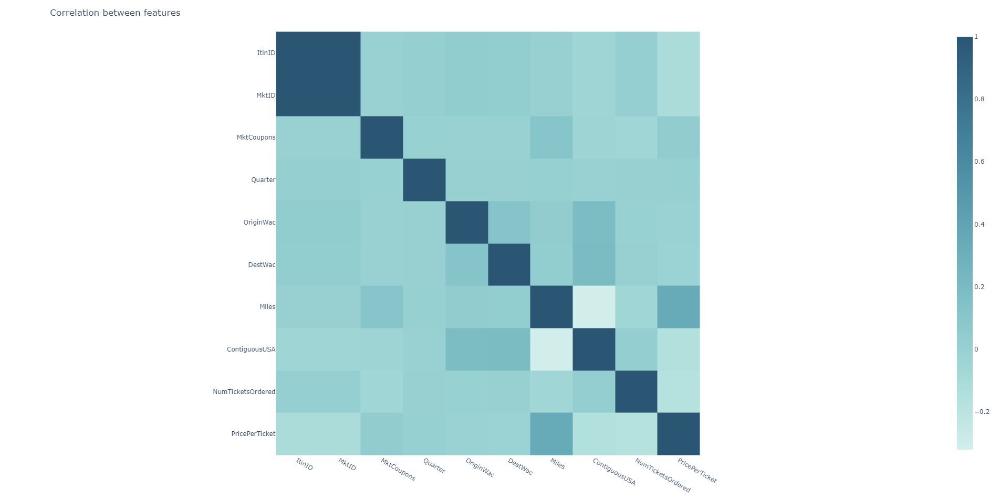

# Understanding & Processing The Data
Since creating the previous part about delays I've learned about few things that might help me with past issues. In this document I will try to understand the data that I'm working with without a very in-depth analysis. I'm going to focus more on feature engineering and processing the data to fit my needs accordingly to the data set statistics. 

### Key ideas:

- When working with a bigger dataset, it's useful to set up a Big Query
- There is a way of encoding the features with a lot of categories inside called label encoding


## Exploring the information

In this section we're going to explore the data we're working with and show some plots on distribution as well as the relationship between features and **our target - the price.** We will start by displaying some general information. As an introduction I will say that we're dealing with New Zeland's data from the year 2019. 

```
RangeIndex: 162833 entries, 0 to 162832
Data columns (total 11 columns):
 #   Column        Non-Null Count   Dtype 
---  ------        --------------   ----- 
 0   Travel Date   162833 non-null  object
 1   Dep. airport  162809 non-null  object
 2   Dep. time     162833 non-null  object
 3   Arr. airport  162809 non-null  object
 4   Arr. time     162828 non-null  object
 5   Duration      162833 non-null  object
 6   Direct        162833 non-null  object
 7   Transit       123077 non-null  object
 8   Baggage       2311 non-null    object
 9   Airline       162828 non-null  object
 10  Airfare(NZ$)  162833 non-null  int64 

```

### The schema

| Travel Date | Dep. airport | Dep. time | Arr. airport | Arr. time | Duration | Direct | Transit | Transit | Airline | Airfare(NZ$) |
| ----------- | ------------ | --------- | ------------ | --------- | -------- | ------ | ------- | ------- | ------- | ------------ |
|             |              |           |              |           |          |        |         |         |         |              |

As we can see in the table I created above, there's some data that needs to be transformed to be useful and some columns to be cleaned. Before anything I will also see how many null values we have in case that we don't have to work on a column because it doesn't consist enough important information. For now the plan is to:

- Transform the duration column to: 1h 20min --> 80min
- Change the values in direct to following:
  - Direct --> 0
  - 1 Stop --> 1
  - 2 Stops --> 2
  - etc.

- Divide the transit into the transit time and type columns

  - 9h in NSN --> 540min(Transit Time) & NSN (Transit Type)

    

```
Travel Date      0.00
Dep. airport     0.01
Dep. time        0.00
Arr. airport     0.01
Arr. time        0.00
Duration         0.00
Direct           0.00
Transit         24.42
Baggage         98.58
Airline          0.00
Airfare(NZ$)     0.00
```

It looks like the baggage column won't be too useful so I think it's fair to just drop it. In the case of null values below 0.05% I'm going to do the same. The only column I will take care of is the transit.

### Missing columns & sanity of the information

I checked for missing columns and such but it's different than the last time, the data set was previously cleaned so we're working with a clean and organized one. I'm still going to check for sanity of them just in case.

```
Unnamed: 0           0.0
ItinID               0.0
MktID                0.0
MktCoupons           0.0
Quarter              0.0
Origin               0.0
OriginWac            0.0
Dest                 0.0
DestWac              0.0
Miles                0.0
ContiguousUSA        0.0
NumTicketsOrdered    0.0
AirlineCompany       0.0
PricePerTicket       0.0
```

```
Columns are sane: True
```


### Skewness

One of the things that we should definitely check is skewness, we can then verify which is considered normal for this dataset and use transformation on columns that don't adhere to that idea. I noticed that most of the columns have 1.5 - 3, but there were a few with a big difference. Here's the numbers after using the Yeo-Johnson method.

```
Skewness after normalization:
ItinID              -2.045501
MktID               -2.045501
MktCoupons           7.251936
Quarter             -0.045702
OriginWac           -0.017259
DestWac             -0.018266
Miles                0.942547
ContiguousUSA       -3.898311
NumTicketsOrdered    0.646620
PricePerTicket       0.001518
```


### Correlation between the features

We have a compact amount of solid features this time. As we can see, two of them are so correlated it doesn't even make sense to keep them around so I'm going to drop on of them. Miles and price per ticket have an obvious correlation and we can also notice some minor correlations between the features.




Correlation scatters


Heatmaps


Skewness


## Processing the features


## Creating new features


## Removing outliers


## Encoding the origin and destination


