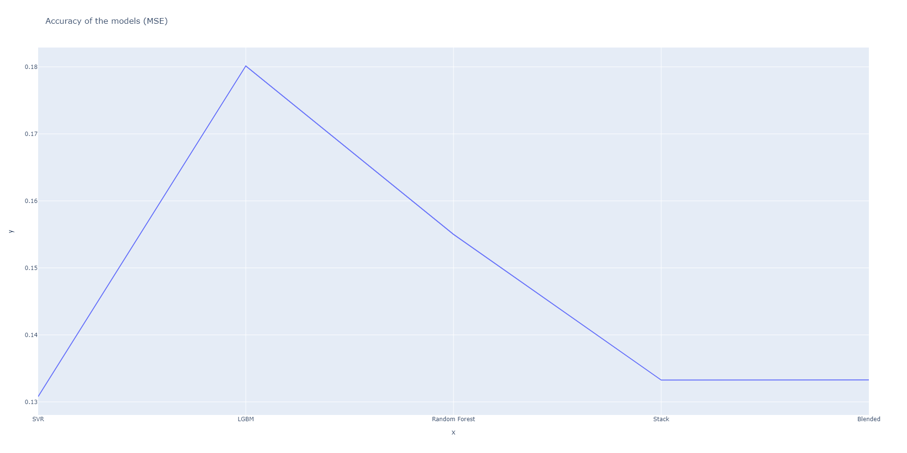

# Predicting

In this document I'm going to walk you step by step trough the model I created and explain the choices I made. Some of the information fill be given in short if the topic is too complex. I'm going to link the notes on them that go more in-depth as I go. First of all, let's start with establishing a few facts:

- I work with already processed data
- I limit the data to 5k rows since I don't think there would be that big of a change if we tried to run it on a bigger set, the information seems to repeat, and I value the time spend on the project
- The whole data set can be analysed without any issue using something like BigQuery, I might create a basic showcase file in the future for that purpose


## Splitting the data

Let's begin by splitting the data into variables. I chose to use 20% of it for the validation and the rest for training purposes.

```Python
# Select a subsample of data
data = data.head(5000)
y = data['Airfare(NZ$)']
X = data.drop(['Airfare(NZ$)'], axis=1)
X_train, X_test, y_train, y_test = train_test_split(X, y, test_size=0.33, random_state=42)
```


## Cross validation & scoring system

I put these next to each other because they serve the same purpose - they help us understand the accuracy of the model. In our case the situation is not quite complex, so I'm going to use a standard KFold validation with 5 splits and MSE for scoring.

```python
# Create cross-validation
cv = RepeatedKFold(n_splits=12, n_repeats=4, random_state=24)

# Define a scoring system
def mse(y, y_pred):
    return mean_squared_error(y, y_pred)
```


## Define models

I think it's time to explain how I'm going to create our model. My bet is on stacking and blending the models together to achieve higher accuracy. I actually tested it a few times before and I'm always surprised by how much better it is over just using one model. It makes sense that it works that way, we use the models similarly to how random forest works, but in our case we have 3-5 models "voting" on what they think is right. When working with regression, I simply multiply the output by a weight that I manually assign to the model. The weight usually comes from the singular effectiveness of a model that we can check after fitting by just running some predictions. My rule of thumb is to give stacked models the biggest decision power, and gradient boost the second. 

Short note on gradient boost to reason my decision there - it's a very, very powerful model. It's known for being the superpower that tops Kaggle competitions, has a quick running time because of the way light gradient boosting is applied that you can read about in [this paper](https://papers.nips.cc/paper/2017/file/6449f44a102fde848669bdd9eb6b76fa-Paper.pdf), but also has some trouble with overfitting. The latter I plan to fight with a grid search parameters, perhaps using something like random forest as another model in the stack (since it's not prone to overfitting) could be a safety net for us too. The last model that I'm considering is a simple SVM model, one of the most popular tools in ML that uses a kernel to map inputs into multi-dimensional feature spaces. I think it could be quite effective in this case.


**This is what we work with for now:**

```Python
lgbm = LGBMRegressor(
        learning_rate=0.1,
        max_bin=150,
        boosting_type='goss'
)

svr = SVR(kernel='rbf')

rf = RandomForestRegressor(n_jobs=-1,
                           oob_score=True)
```


## Implementing grid search

We're working with a few models and how much we can estimate what the best parameters could be, it's always the best to check them with a grid search by the end of the day. I won't be just picking random things, but rather choosing the most rational picks and trying out which one fits the situation the best.

```Python
# Grid-search
param_grid_lgbm = {
    'num_leaves': [80],
    'max_depth': [7, 10],
    'n_estimators': [200],
    'min_data_in_leaf': [100, 300]
}

param_grid_svr = {
    'C': [0.1, 1, 100],
    'epsilon': [0.001, 0.1, 1],
    'gamma': [0.1, 1, 3]
}

param_grid_rf = {
    'n_estimators': [50, 100],
    'max_depth': [5, 20]
}
```


## Blending + stacking

Model stacking is nothing else than an efficient way of creating new predictions based on the selected models and the model regressor. On top of that I will also use blending which is, like I explained before, helping a lot with getting even more accurate predictions. Here's how I made it work.

```Python
# Stacking the models
stack = StackingCVRegressor(regressors=(lgbm_fit, rf_fit, svr_fit),
                            meta_regressor=svr_fit,
                            use_features_in_secondary=True)
# ...

# Blend predictions
def blended(X):
    return ((0.20 * svr_fit.predict(X)) +
            (0.15 * lgbm_fit.predict(X)) +
            (0.15 * rf_fit.predict(X)) +
            (0.50 * stack.predict(np.array(X))))
```


## Exploring the results

**It's finally time to predict the test data and see how well our model performs.** I will display the MSE for each model and the stacked model first and then talk about the final, blended result. Finding the best result wasn't in fact something that took a short amount of time, it was the opposite. Aside of running the cross validation and the grid search, even after getting a satisfying result I decided to go into more detail on how to make the model in the better. In the early stages it was very visible that it had some trouble with overfitting, the difference between predictions on the train and test sets was significant (0.067 vs 0.15). It made me rethink the parameters that I used and I decided to tweak them a little bit, above you see the final code but before it got this way I also tried different ways to prevent overfitting in the LGBM and making the training time of the Random Forest quicker, at the same time making sure that it won't take a toll on the accuracy. The models are quite popular and the documentation for them is really good, there's also plenty of papers and articles on them so finding the information didn't take much time. **Here's the last and the best result I got so far:**



After receiving this result I was surprised to see how well the SVR scored in comparison to other methods. It happened to the point that blending the models didn't seem to have that big of a power when it came to the final accuracy, and even lowered it a little bit. Despite the maximum difference being equal to only 0.05, it still made me wonder if perhaps the model was the best suited for the task and my configuration of the rest of them wasn't really the deciding factor. Just a small note to those not familiar with SVM's, they are very flexible algorithms that not only prevents overfitting quite well but also model non-linear relationships between data.

Having this information, I think if the code was supposed to be deployed, using the SVR alone would be the best option as it saves time and doesn't cost us any accuracy.

